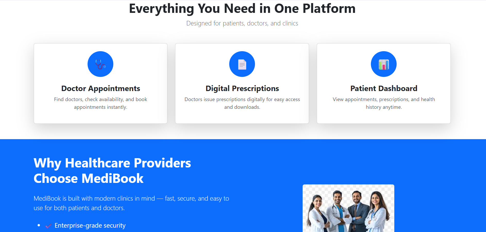
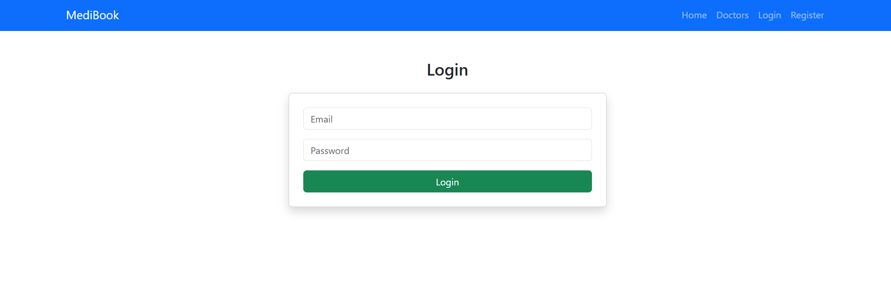
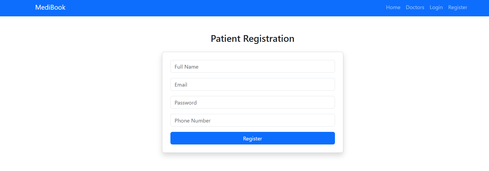
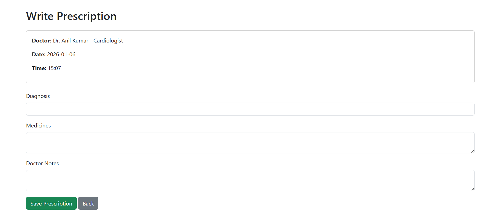
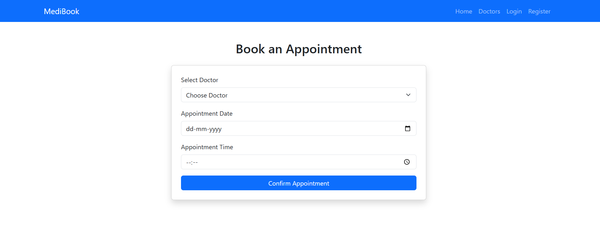

# MediBook – Online Clinic Management System

MediBook is a Spring Boot based web application for managing clinic operations such as:
- Patient registration & login
- Doctor dashboard
- Online appointment booking
- Prescription management
- Admin controls

## Technologies Used
- Java
- Spring Boot
- Spring Security
- Thymeleaf
- MySQL
- HTML, CSS, Bootstrap

## Features
- Role-based authentication (Admin / Doctor / Patient)
- Book and manage appointments
- View prescriptions online
- Secure login system

  ## 🖥️ Screenshots

## Home Page




## Authentication



## Doctor Module



## Appointment


## How to Run
1. Clone the repository
2. Configure MySQL in `application.properties`
3. Run the application using:
   ```bash
   cd demo
.\mvnw spring-boot:run
